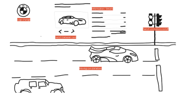
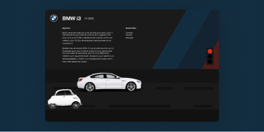
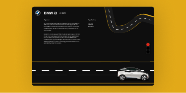
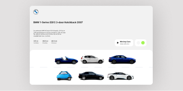
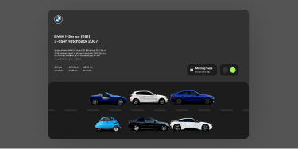
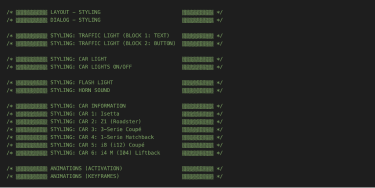
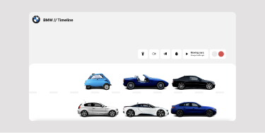
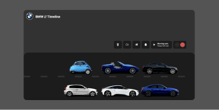
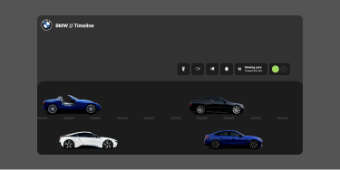
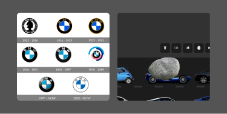

# Procesverslag

## Jij

### Ontwerper:
Coen Janssen // `500851877` 

#### Je startniveau:
Blauw / Rood

Mijn startniveau voor de opstart van de website is in eerste instantie blauw, dit omdat het meeste code-gebruik inmiddels wat verwaterd is en het niet mijn 'main focus' is. Uiteraard ga ik wel experimenteren met 'rode' elementen.

# Je plan

  
De eerste versie/schets van je ontwerp & je persoonlijke uitdaging

  ### De eerste versie/schets:
  

  ### Concept: 
  Verschillende automerken zijn al sinds jaren niet meer weg te denken uit het straatbeeld. Zo ook niet de welbekende BMW's. De tijdlijn vormt een rij voor een stoplicht met BMW auto's door de jaren heen. Van een BMW Isetta tot aan de nieuwste BMW i4 (elektrisch). Om de website levendiger te maken is er een control pannel waarmee bijvoorbeeld het stoplicht bediend kan worden om de auto's te laten rijden, de auto's te laten toeteren en lampen aan en uit te zetten. 

  ### Je ambitie: 
  Aan deze technieken/punten wil ik werken:
  - Het positioneren van elementen via Flexbox of Grid.
  - Het (deels) responsive maken van de pagina, minstens tot tablet formaat.
  - JavaScript functies gebruiken om interacties te laten werken. 
  - Nieuwe CSS / JS / HTML elementen gebruiken die ik nog niet ken. 
  - Het coderen over zijn algemeen weer wat opfrissen (lang niet gebruikt).
 

## Het proces (in het kort)

  
Zo is mijn website ontstaan

  #### Design 1:
  
  
  Om een beter beeld te krijger hoe de website eruit komt te zien, heb ik de schets ook digitaal gemaakt. 

  #### Testen:
  
  
  Het idee is helder, maar gaat het mij lukken om alles werkend te krijgen - zoals ik het in gedachten heb? Hiervoor ben ik eerst gaan testen in Codepen.

  #### Design 2:
  
  
  Ik was wat aan het stoeien met de stijl: de auto's zijn realistisch de achtegrond wat cartoonish, dit botst teveel vond ik. Hier heb ik een kleine aanpassing gedaan om de weg wat realitscher te maken.

  #### Design 3A (Light):
  
  
  
  Terug naar de tekentafel om het ontwerp simpeler te maken, hierbij heb ik rekening gehouden met de eenvoud om zowel voor light- als darkmode te kunnen ontwerpen. De simpelheid is gebaseerd om de minimalistische en schone showrooms van de autodealer.
  

  #### Design 3B (Dark):
  

  Naast de light-mode werkt de website ook met een donkere modus aan.

  #### Clean up!:
  

  Aan het eind ben ik de code gaan opschonen en het overzichtelijk maken van alle code.

## Voortgang/Feedback 1

  
Mijn bevindingen + wijzigingen (minimaal 5)

  ### Bevinding 1:
  Het concept past goed bij het onderwerp. Alle interactieve elementen hebben te maken met auto's. Echter niet specifiek BMW, wat is er BMW eigen aan dit concept? Dit zou je ook precies zo met Audi of Mercedes kunnen doen.

  #### oplossing:
  Wie rijdt er nou in een Audi of Mercedes? Nee, maar hetzelfde geldt hier voor Joost en Wessel; waarom specifiek die Pokémon - wat maakt die beter dan een andere? Of waarom een Playstation in plaats van een Xbox? Daarom is het onderwerp gekozen op een persoonlijke voorkeur, waarbij de interactieve elementen passend zijn bij de auto. 

  Kenmerkende punten voor BMW-rijders zijn vaak: geen knipperlicht gebruiken en seinen (bij hoge snelheden), wellicht dat er dit soort kleine kenmerken verwerkt kunnen worden binnen de website om het toch kernmerkend te maken.

  ### Bevinding 2:
  Wat mij betreft is het concept krachtig genoeg. Progressive disclosure is enigszins toegepast. Je ziet per auto pas wat er achter schuilt, je zou met de logo's kunnen spelen, dat je ziet dat er andere logo's zijn.

  #### oplossing:
  Het beeldmerk van BMW is door de jaren heen sterk veranderd, waar er vroeger veel detail was is het tegenwoordig zo minimalistisch mogelijk gemaakt. De gekozen auto's binnen de website zullen in jaren sterk verschillen, hierdoor gaat het logo soms natuurlijk ook terug in de tijd en soms weer richting het huidige. 

  Wanneer een auto vooraan rijdt, past het logo zich aan naar mate in welk jaartal je zit met de auto. Andere optie zou zijn om wanneer je in de details duikt van een specifieke auto, dat daarmee het logo veranderd.

  ### Bevinding 3:
  Probeer na te denken over de 'zero state' van de site, staan alle auto's er gelijk al of moet je het stoplicht aan zetten om ze allemaal te zien?

  #### oplossing:
  Wanneer je de website bezoekt staan alle auto's te wachten op het stoplicht. Hierdoor kun je gelijk op elke auto klikken om meer informatie te tonen over deze specifieke auto. De interacties op deze webpagina moeten handmaken (door middel van 'clicks') geactiveerd worden, zo ook het stoplicht. 

  ### Bevinding 4:
  Leuke paasei, stoplichten zijn interactief en passen bij het onderwerp.

  #### oplossing:
  Omdat het in eerste instantie misschien niet duidelijk genoeg is (ondanks de veranderde cursor) dat het stoplicht klikbaar is om te auto's te laten rijden is er een nieuw element toegevoegd met een play en pause button. Daarnaast staat een korte toelichting over wat je ermee activeerd.

  ### Bevinding 5:
  Zelfde geldt voor de rijdende auto's. Die passen bij het rode/groene stoplicht. Wel/niet rijden.

  #### oplossing:
  Klopt - wanneer je overmatig gebruik maakt van het stoplicht of de play-pause button dan kan het wel eens zijn dat er een kleine fout ontstaat, hierdoor kan het zijn dat er soms een auto door rood licht rijdt. Dit zal ik proberen te fine-tunen, al hoewel het ergens ook wel past bij BMW-rijders - toch?

## Voortgang/Feedback 2

  
Mijn bevindingen + wijzigingen (minimaal 5)

  
  ### Bevinding 1:
  De site is nog niet volledig werkend op GitHub, onder andere de fonts en een afbeelding van de auto wordt niet getoond. 

  #### oplossing:
  Meer uploads doen richting de GitHub omgeving om niet alleen via de live server op mijn eigen machine te testen, maar juist te controleren of het allemaal ook vlekkeloos gaat op andere systemen en de online omgeving. Dit heb ik uiteindelijk toegepast en opgelost.

  ### Bevinding 2:
  Niet alle interactieve elementen kunnen met het toetsenbord (tab) geselecteerd worden, deze kun je eventueel nog toevoegen.

  #### oplossing:
  Klopt - helemaal aan het eind, wanneer de design staat en de interacties op de pagina werkend zijn dan zal ik gaan kijken naar eventuele toegankelijkheidsverbeteringen zoals het bedienen van animaties met het toetsenbord en een eventuele screenreader, mits de tijd het toelaat.

  ### Bevinding 3:
  Binnen de HTML van je website heb je een 'onnodige wrapper', zo zet je een section om je OL neer. Dit zou overbodig zijn, OL is zelf al een wrapper.
  
  #### oplossing:
  Gezien ik super blij en trots ben dat het momenteel allemaal werkt, zal ik aan het eind bij het opschonen van de code kijken of het nog mogelijk is om dit ook erbij op te pakken. Indien er geen tijd meer zal zijn, laat ik hem stiekem toch lekker staan - dan werkt het in ieder geval!

  ### Bevinding 4: 
  Custom properties ben je van plan te gebruiken, maar deze zie ik nog niet terug in je code. Omdat je nu extra elementen toevoegd is dit wel handig.

  #### oplossing:
  Ik ga een kleine opschoonronde door de code doen, daarmee wil ik direct de functionaliteit light- en darkmode gaan maken. Wanneer dit gebeurt worden uiteraard gelijk een aantal custom properties aangemaakt. 

  ### Bevinding 5:
  Momenteel zie ik nog geen bronnen terug in de ReadMe, voeg je deze nog toe?

  #### oplossing:
  Er blijft natuurlijk een groot gedeelte van de code zelf getypt, daarnaast hebben Sanne en Joost hier en daar geholpen met het fine-tunen of verbeteren hiervan. De overige bronnen komen in de code te staan en onderaan deze ReadMe, deze zijn uiteraard wel bijgehouden. Dus, ja!

## Voortgang/Feedback 3

  
Mijn bevindingen + wijzigingen (minimaal 5)

  
  ### Bevinding 1:
  Probeer de lichten van de auto's nog wat te fine-tunen, nu zie je dat het aan de randen af en toe afgebroken wordt. Dat verpest het effect!

  #### oplossing:
  Ik ga de afbeeldingen met de lichten nog wat fine-tunen in Photoshop en daarmee rekening houden met de randen zodat deze niet overlappen.

  ### Bevinding 2:
  Probeer de beschrijving van de auto's gelijk te maken; één dat ze hetzelfde bieden qua informatie maar ook zodat het design niet verspringt.

  #### oplossing:
  De teksten moet ik nog maken en/of vinden voor de specifieke auto's, maar goed punt - hier zal ik rekening mee proberen te houden.

  ### Bevinding 3:
  Misschien kun je nog een easter-egg toevoegen bij het logo, eerder had je het al over het verander van het logo - dat gebeurt nu nog niet.

  #### oplossing:
  De tijd laat het misschien niet helemaal toe om alles te doen wat ik wilde doen qua interacties, ook omdat sommige code soms nog wat lastig was en wat meer tijd in beslag nam dan gepland. Het principe van JavaScript om afbeeldingen te replacen bij een button klik (interactie) ken ik, dit zou ik op het laatste moment nog kunnen toepassen voor het logo.

## Reflectie

  
Mijn eindresultaat & persoonlijke ontwikkeling

  Het is leuk om zo weer eens even bezig te zijn geweest met code zoals HTML, CSS en JS. Het was bij mij allemaal al ver weggezakt gezien dit niet iets is wat ik zelf dagelijks doe. Van een eerste idee, met een aantal iteraties daarop, is het uiteindelijk een leuk resultaat geworden. In het begin dacht op het gebied van mijn concept: waar ben ik aan begonnen? Zeker nadat ik veel had probeerd om het stoplicht werkend te krijgen. Uiteindelijk is dit met hulp gelukt, wat natuurlijk het show-element van de website is geworden. Het aantal minimale interacties die je nog uit kunt voeren op de website is ook leuk geworden, ik wilde liever gaan voor kwaliteit dan kwantiteit dat is goed gelukt(*).

  (* = Behalve de vallende steen, die moest er gewoon last-minute nog in.)

  ### Je uitkomst - karakteristiek screenshot(s):
  
  

  ### Dit ging goed/Heb ik geleerd: 
  
  Ik heb over het algemeen weer de basis HTML, CSS en JS goed opgefrist. Daarnaast heb ik leren werken met VH, WH en EM. Dit is iets wat ik voorheen nog altijd met pixels deed en de reden waarom ik altijd moeite had met het responsive maken van de pagina. Ook flexbox en grid zijn nu redelijk duidelijk voor mij wat me zeker helpt met volgende projecten. Een nieuw element is het dialog popup maken, wat iets nieuws was voor mij - en ook nog eens direct goed werkte. Al met al veel geleerd en het was stiekem nog best leuk ook.

  
  

  ### Dit was lastig/Is niet gelukt:

  Wat vond ik niet lastig? Bijna alles wel. Telkens probeerde ik het zelf een keer op 5, dan googlen, dan vragen aan een klasgenoot. Als dat niet lukte, vinger de lucht in en het vragen aan Sanne. Soms was dit samen wel even puzzelen, maar alles wat ik in de les 'opgelost' wilde hebben is allemaal goed gelukt. De lessen heb ik goed benut om aan de website te werken en daarmee heb ik een mooi resultaat neergezet. Wat helaas niet gelukt is, is om een echt grappige easter-egg toe te voegen; de vallende steen (matig uitgewerkt helaas), het veranderen van de BMW logo's en eventueel een extra afbeelding bij de informatie tonen van elke auto. 

  

  ### Kortom:

  Super leuke en nuttige lessen om je code-kennis weer op te frissen en de knutselen met CSS en JS. Helaas qua tijd wat aan de korte kant (1,5 a 2 weken), dit had wel wat langer gemogen. Zo zou ik dit vak zelf graag gecombineerd zien worden met een vormgevingsvak (schets > wireframe > UI Design > Coderen). 

  Bedankt Sanne!

## Bronnenlijst

continu bijhouden terwijl je werkt

1. Wikipedia auto 1: https://nl.wikipedia.org/wiki/Isetta 
2. Wikipedia auto 2: https://nl.wikipedia.org/wiki/BMW_Z1 
3. Wikipedia auto 3: https://nl.wikipedia.org/wiki/BMW_E46 
4. Wikipedia auto 4: https://nl.wikipedia.org/wiki/BMW_1-serie 
5. Wikipedia auto 5: https://nl.wikipedia.org/wiki/BMW_i8 
6. Wikipedia auto 6: https://nl.m.wikipedia.org/wiki/BMW_4-serie#i4 
7. Informatie auto's: https://www.autoevolution.com/cars/bmw-3-series-sedan-2018.html#aeng_bmw-3-series-sedan-g20-2018-320i-8at-184-hp 
8. Afbeeldingen: https://www.carsized.com/en/cars/compare/bmw-isetta-1955-1-door-cabriolet-vs-bmw-i3-2013-5-door-hatchback/ 
9. Flexbox: https://css-tricks.com/snippets/css/a-guide-to-flexbox/
10. Grid: https://css-tricks.com/snippets/css/complete-guide-grid/
11. Joost tijdens de les!
12. Sanne tijdens de les! 
13. Animsta: https://animista.net/ 
14. Filters: https://stackoverflow.com/questions/22252472/how-to-change-the-color-of-an-svg-element
15. Darkmode: https://css-tricks.com/a-complete-guide-to-dark-mode-on-the-web/ 
16. Vallende steen: https://1stwebdesigner.com/14-css-animations-for-fall/ 

